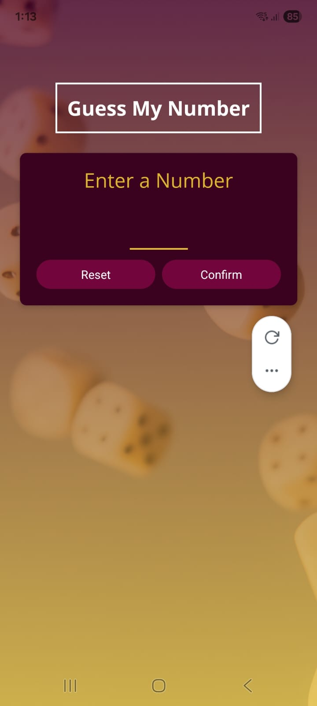
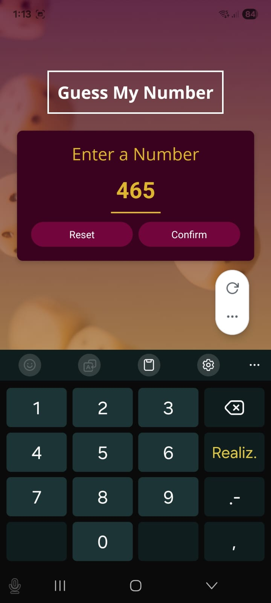
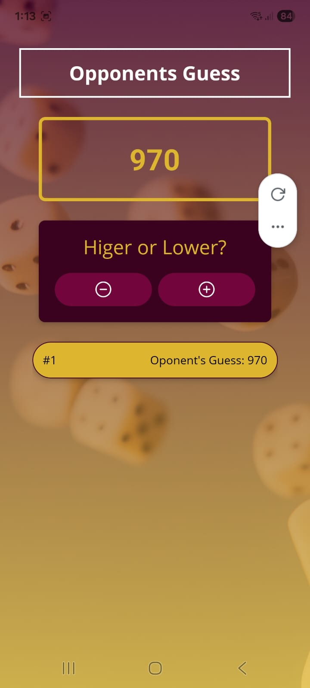
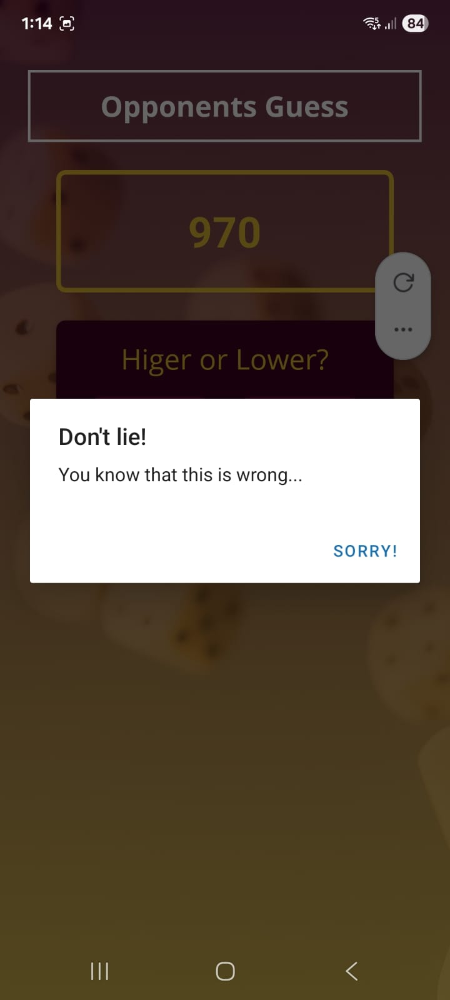
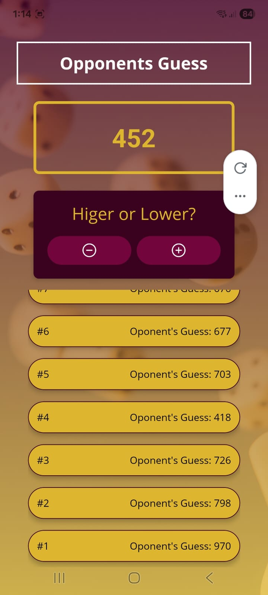

# React Native - The Practical Guide [2025]

Repositorio con ejercicios y proyectos prácticos del curso **"React Native - The Practical Guide [2025]"**  
impartido por **Maximilian Schwarzmüller** en **Udemy**.  

Este repositorio refleja el progreso y aprendizaje en React Native, desde conceptos básicos hasta proyectos prácticos.

---

## Estado del curso

- **Avance actual:** 33%  
- **Proyecto destacado realizado:**  
  - **Juego de adivinanza de números:**  
    - El usuario ingresa un número entre 1 y 999.  
    - El celular intenta adivinar el número ingresado.  
    - Se cuentan los **rounds** necesarios para acertar.  
    - Interfaz con **estilos aplicados** para una presentación simple y amigable.
<div>






</div>

---

## Tecnologías utilizadas

- React Native  
- Librerías adicionales: IonIcons

---

## Cómo ejecutar los proyectos

1. Clona este repositorio:

```bash
git clone https://github.com/EnriqueIsra/ReactNative.git
cd ReactNative
```
2. Instala las dependencias
```bash
npm install
```
3. Inicia la aplicación
```bash
npm start
```
4. Escanea el código QR con la aplicación de Expo desde tu celular.   
No requiere setup especial. puedes ejecutar la app directamente con Expo Go en tu dispositivo móvil o en un emulador.
